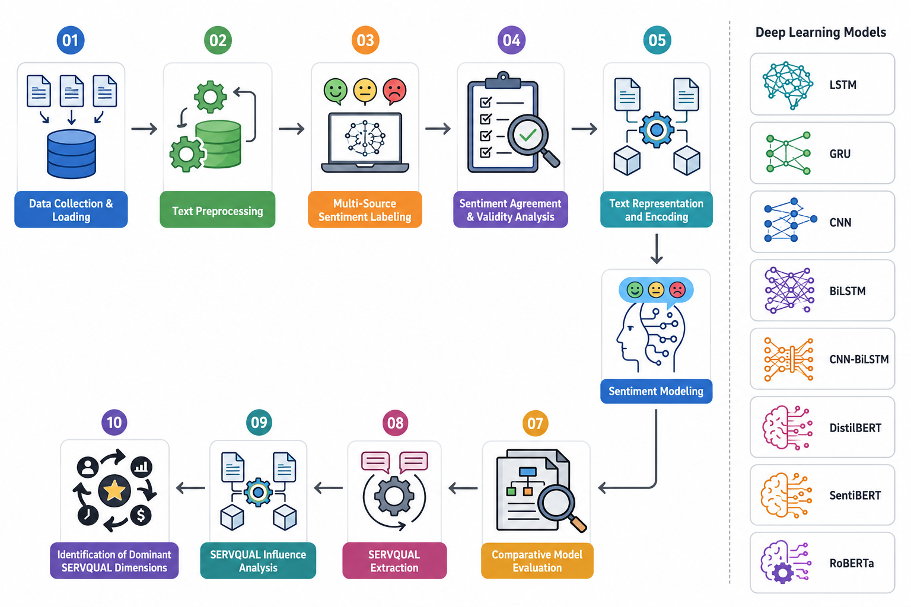

# UberEats Sentiment Analysis using Deep Learning, Transformers, Explainable AI, and SERVQUAL

Developed an end-to-end sentiment analysis framework on ~965K UberEats customer reviews by combining Deep Learning, Transformer models, Explainable AI, and service quality analytics.

## Methodology

## Key Highlights

- Built and evaluated LSTM, GRU, BiLSTM, CNN, CNN-BiLSTM, DistilBERT, BERTweet, and RoBERTa models.
- Implemented a multi-source sentiment labeling framework using Star Ratings, VADER, and RoBERTa-based sentiment predictions.
- Achieved best performance with RoBERTa (95.22% Accuracy, 92.85% Macro-F1) and validated results on a human-annotated dataset.
- Applied SHAP explainability to provide token-level interpretation of transformer predictions.
- Engineered SERVQUAL features (Assurance, Reliability, Tangibles, Empathy, Responsiveness) to analyze service quality drivers of customer sentiment.
- Performed Ordinal Logistic Regression and VIF analysis to statistically validate the influence of service attributes and assess multicollinearity.

## Technologies

Python • TensorFlow • Hugging Face Transformers • Scikit-Learn • SHAP • Statsmodels • NLTK • Pandas • NumPy • Matplotlib • Seaborn

## Results

## Model Performance

| Model | Accuracy |
|---------|---------|
| LSTM | 92.43% |
| GRU | 92.39% |
| BiLSTM | 92.13% |
| CNN | 92.19% |
| CNN-BiLSTM | 93.25% |
| DistilBERT | 93.30% |
| BERTweet | 94.82% |
| RoBERTa | 95.22% |

**Best Performing Model:** RoBERTa (95.22% Accuracy)

This project demonstrates the effectiveness of transformer architectures for large-scale sentiment classification while enhancing interpretability and business insight generation through Explainable AI and service quality feature engineering.

Code and datasets will be released after publication.
